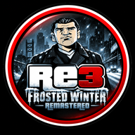
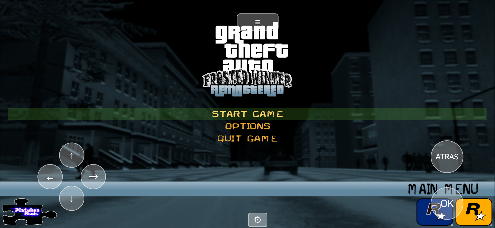
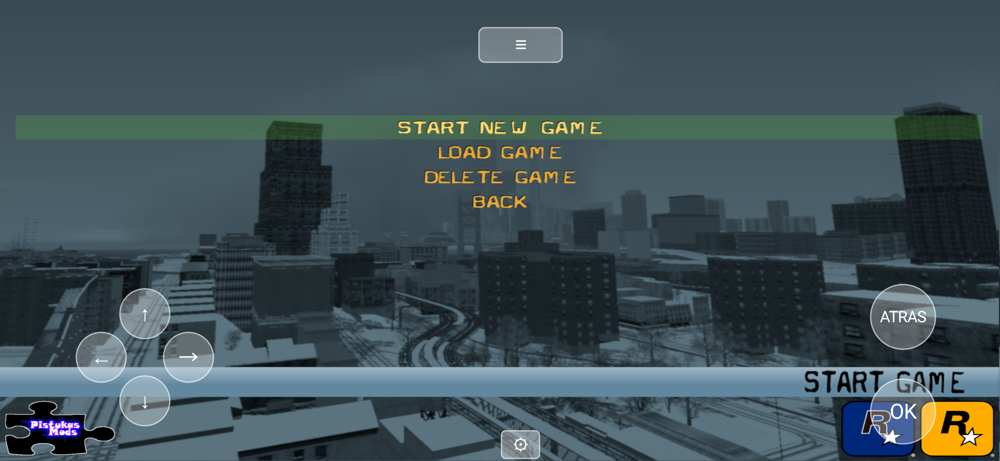
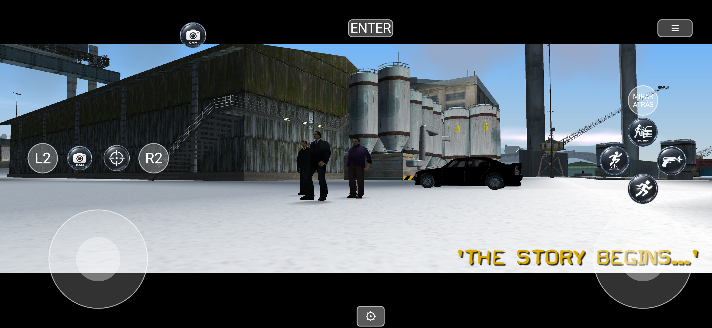

# RE3 Frosted Winter Port Experimental

Trabajo experimental para correr el mod de GTA III **Frosted Winter Remastered** (de Pistukas Mods) sobre el port a Android de [RE3 Android Evolved](https://github.com/codepdbh/re3-android-port-evolved) (mismo motor, mismo autor).

## Estado: se juega

Menú, "iniciar nueva partida", la cinemática de intro y el diálogo de la primera misión andan de punta a punta sin crashear. Antes ni siquiera pasaba del menú — el mundo se dibujaba como estática y el juego moría al segundo o dos de arrancar la partida. Todavía queda pulir cosas (ver [Pendiente](#pendiente) abajo), pero ya es jugable.

| Menú principal | Nueva partida | Cinemática de intro |
|:---:|:---:|:---:|
|  |  |  |

## Qué es esto

Un product flavor de Gradle nuevo (`fwr`) agregado sobre el mismo código de `re3-android-port-evolved`:
- Mismo motor (código C++ compartido), mismos arreglos de Android.
- App separada (`com.re3.game.fwr`, ícono propio) que lee sus archivos de juego de una carpeta distinta en el celular (`re3GTA_FWR`), para convivir instalada junto al juego base sin pisarlo.
- El mod se instala como overlay: primero una copia completa del GTA III base (para traer `anim/`, config, etc. que el paquete del mod no incluye por sí solo — asume que lo copiás encima de una instalación existente), y encima los archivos propios del mod (mapas, texturas, modelos, audio, `MAIN.scm`).
- Los `.dll`/`.asi`/scripts `.cleo` del paquete original del mod (para PC, vía inyección en el `.exe`) no sirven en Android y fueron excluidos — no hay intérprete de CLEO en este motor.

## Bugs de compatibilidad con mods encontrados y arreglados acá

Varios límites y faltas de verificación del motor original, nunca antes disparados con el juego base, que un mod "total conversion" (mapas/vehículos/scripts mucho más pesados o distintos a los originales) sí dispara.

**Arranque / carga:**
- Varios límites de memoria fijos (`NUMOBJECTINFO`, `NUMPTRNODES`, `NUMBUILDINGS`, etc. en `config.h`) dimensionados para los mapas originales.
- Modelos de vehículo con listas de materiales mal formadas (entradas nulas o punteros basura) que el motor no esperaba.
- Un bug real en el parser de modelos `.dff` de librw (índice de material compartido sin verificar límites) — parcheado en el fork [librw-re3-android](https://github.com/codepdbh/librw-re3-android).
- Un sprite de pantalla de carga compartido (`LoadSplash()`) cuyo TXD puede ser reciclado por el sistema de streaming sin avisar — causaba varios crashes distintos en puntos distintos del arranque.
- Sistema de variables de debug (`CTweakVars`) deshabilitado para Android — no se usa (no hay menú de debug táctil) y crasheaba al registrarse.
- Un `.col` (colisión) modificado más grande que el buffer fijo de 55 KB (`work_buff`) del motor original desbordaba y pisaba globals vecinas apenas arrancaba la partida — la causa de la pantalla de estática/ruido y crash inmediato al iniciar juego.

**Scripts de misión (`MAIN.scm`):**
- Varias instrucciones del script compilado del mod codifican un operando de variable local en un opcode que solo espera uno global (o al revés) — el motor lo tomaba como corrupción y abortaba; en realidad es inofensivo y ahora se tolera.
- Cuando un comando de script pide más parámetros de los que el mod realmente codificó, el intérprete leía basura del siguiente opcode. Ahora completa con 0 y resincroniza en vez de crashear.
- Un hilo de script del mod (`CLEOVOL`, para las teclas de volumen) usa opcodes de **CLEO**, que este motor no interpreta — no hay soporte de CLEO acá. Se neutralizó ese hilo específico.
- Dos comandos de misión (`SET_CHAR_IS_CHRIS_CRIMINAL`, la familia `LOCATE_PLAYER_*_CAR`) asumían que el ped/vehículo referenciado siempre existía; el script modificado del mod los usa en casos donde no, y el motor moría en el assert en vez de simplemente responder que no.
- Los iconos HUD personalizados que dibuja el script (`LOAD_SPRITE`/`DRAW_SPRITE`) no tenían límite de rango contra el array fijo de 16 slots — el mod usa más iconos de los que el motor original nunca necesitó.
- Una textura corrupta o en un formato no soportado por una TXD modificada hacía crashear el loader en vez de simplemente descartar esa textura.

Ver el historial de commits para el detalle completo de cada uno.

## Pendiente

- **Voces personalizadas:** la introducción carga M00D03 a M00D22 en orden. Se adaptaron las llamadas de audio del mod y la consulta CLEO de teclas; queda comprobar el resto de las misiones.
- **Estática breve y transitoria** al entrar a partida nueva, unos segundos antes de que cargue la cinemática — se resuelve solo, no hace falta reiniciar, pero conviene investigar la causa exacta.
- Es de esperar que aparezcan más instancias del mismo patrón de "el script del mod no coincide exactamente con lo que el motor espera" a medida que se avanza más allá de la primera misión — cada una encontrada hasta ahora fue rápida de arreglar.

## Actualización 1.0.8-fwr

- Corregido el salto automático de diálogos: `05EE` consulta una tecla y consume su argumento; terminar una voz ya no equivale a pedir que se salte la escena.
- Guardados propios en `/storage/emulated/0/re3GTA_FWR/fwr_userfiles/`. FWR ya no lee las partidas de `userfiles` que puedan haberse copiado con los datos del juego base. Los archivos anteriores se conservan y no se migran automáticamente porque pueden pertenecer a GTA III.
- Compilación Android verificada para `arm64-v8a` y `armeabi-v7a`; APK instalado en Samsung y menú de carga comprobado con ocho ranuras libres.
- La prueba de voces recorrió M00D03 a M00D22 y devolvió el control al jugador en Puerto de Portland. No se ha probado toda la campaña.

## Instalación

Requiere una copia legítima de GTA III ya instalada y funcionando con `re3-android-port-evolved` (para tener `re3GTA` con `anim/`, `data/CAPS.DAT`, etc.), más los archivos del mod Frosted Winter Remastered (sin las carpetas `CLEO/`, `scripts/`, `mss/` ni los `.dll` sueltos) copiados encima en `re3GTA_FWR`.

También podés descargar el APK de debug ya compilado desde [Releases](../../releases) para probar directo, sin compilar nada — pero igual necesitás los archivos del juego en el dispositivo.

## Building

Igual que `re3-android-port-evolved`, pero usando el flavor `fwr`:

```
./gradlew assembleFwrDebug
```

## Relación con el repo principal

Este repo parte de una copia completa de [re3-android-port-evolved](https://github.com/codepdbh/re3-android-port-evolved) (mismo historial) para no depender de mantenerlos sincronizados a mano. Los arreglos de robustez del motor que no son específicos de este mod también fueron subidos al repo principal por separado cuando corresponde. El flavor `fwr` y los arreglos más frágiles/específicos de esta investigación quedan solo acá mientras siguen siendo experimentales.
